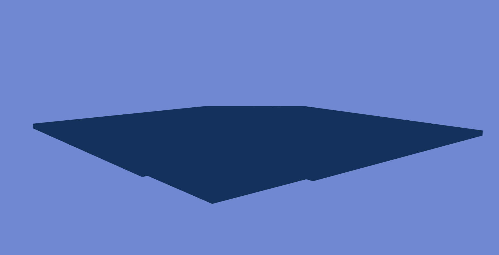
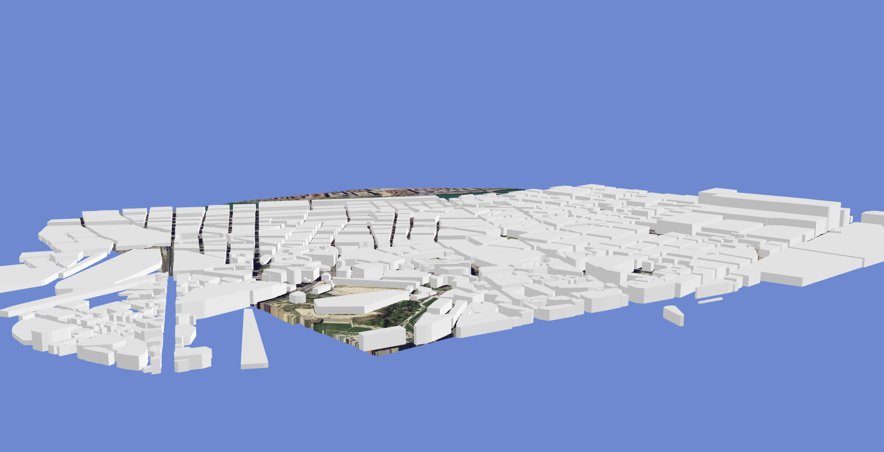
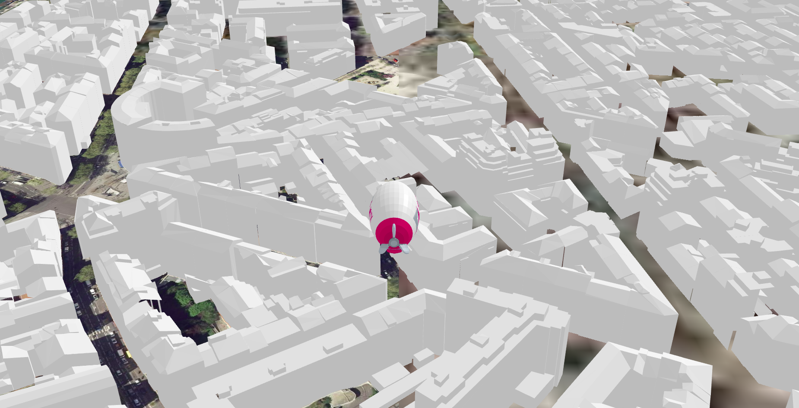

<!-- @format -->


# Local Game tutorial :lion:

Welcome in the first ud-viz game tutorial. We will proceed step by step, if you want to consult the complete project, you can find it in this [folder](../../examples). At the end of this tutorial you will fly with your zeppelin in the sky of Lyon, and collect some spheres!


# Create your game project :smile:

[Working environment](./LocalGameTutorial.md#working-environment)
[Initialize your project](./LocalGameTutorial.md#initialize-your-project)
[Importing ud-viz](./LocalGameTutorial.md#importing-ud-viz)
[Create your game](./LocalGameTutorial.md#create-your-game)
[Parameterize itowns layers](./LocalGameTutorial.md#parameterize-itowns-layers)

## Working environment

Steps :

- Create an empty folder that you can call `My_UD-Viz_Game`.
- Create a html script in your folder that you call `index.html`.

> Open the folder in visual studio code or your favorite IDE :computer:

## Initialize your project

To begin with, here is the **base** of an html script, **copy it**:

```html
<!--index.html-->
<!DOCTYPE html>
<html>
  <head>
    <title>My awesome game</title>

    <meta charset="UTF-8" />
    <meta name="viewport" content="width=device-width, initial-scale=1.0" />
  </head>
  <body></body>
</html>
```

Then you will need to host your game folder (`My_UD-Viz_Game`), to do so you can use your own local server otherwise follow these steps:

> If you chose to host with this way npm and node must be installed. ([Doc link](https://docs.npmjs.com/downloading-and-installing-node-js-and-npm))

- Clone the `UD-SimpleServer` repo separately:

```bash
git clone https://github.com/VCityTeam/UD-SimpleServer.git
```

- Open the SimpleServer repo in a terminal and install node packages:

```bash
npm install
```

- And finally host `My_UD-Viz_Game` folder with this command line:

```bash
node index.js PATH_TO_My_UD-Viz_Game 8000

# PATH_TO_My_UD-Viz_Game might be ../My_UD-Viz_Game if UD-SimpleServer is next to your game folder.
```

You can visit your page at http://localhost:8000/ but nothing is displayed (yet).

## Importing ud-viz


* For this purpose, in your HTML file (`index.html`) add the following script tag in the **\<body\>**.

```html
<script src="./assets/js/udv.js"></script>
```

Still nothing displayed but the library is now globally accessible.
> To keep this tutorial simple ud-viz is imported this way, but a [npm package](https://www.npmjs.com/package/ud-viz) exists and it's recommended to use it since you can benefit of the update with it. You can visit this [repository](https://github.com/VCityTeam/UD-Viz-Template) to see an example of a npm project using ud-viz as a package.


## Create your game

 * Let's create a script tag in the `index.html` and add the following code to start a new local game (*Still in the **\<body\>***):

```html
<script type="text/javascript">
  const myWorld = new udv.Game.Shared.World({
    name: 'My World',
    origin: { lat: 45.7530993, lng: 4.8452654, alt: 300 },
    gameObject: {
      name: 'GameManager',
    },
  });

  const app = new udv.Templates.LocalGame();
  app.start(myWorld, './assets/config/local_game_config.json');
</script>
```

First a new world called `My World` is created, you have to specify at which 3D coordinates you want to create it. Here we take a random location in Lyon. We also specify our root game object which is here called `GameManager`.

Then a [LocalGame](../../src/Templates/LocalGame/LocalGame.js) is instanciated, to start it you need to pass a world and the path to a config file.

* Create a new folder called `./assets/config/` and, in it, a new file called [`local_game_config.json`](../../examples/assets/config/local_game_config.json) composed of the following code:

```json
{
  "game": {
    "fps": 30,
    "shadowMapSize": 2046,
    "skyColor": {
      "r": 0.4,
      "g": 0.6,
      "b": 0.8
    }
  },
  "itowns": {
    "radiusExtent": 1000
  }
}
```

Parameters in `game` section are relative to your [GameView](../../src/Views/GameView/GameView.js) (the framerate, the size of the shadow map and the sky color). The `itowns` parameter is used to crop the area around the location of your world.

Ok, at this point, your **browser** should display something like the following, namely a light blue background and a dark blue slab.



## Parameterize itowns layers

That's great, you don't know it yet but this is Lyon, ok let's make the city appeared !

- Let's add these lines in your `local_game_config.json` file

```json
"background_image_layer": {
    "url": "https://download.data.grandlyon.com/wms/grandlyon",
    "name": "Ortho2018_Dalle_unique_8cm_CC46",
    "version": "1.3.0",
    "format": "image/jpeg",
    "layer_name": "Base_Map",
    "transparent": true
},
"elevation_layer": {
    "url": "https://download.data.grandlyon.com/wms/grandlyon",
    "name": "MNT2018_Altitude_2m",
    "format": "image/jpeg",
    "layer_name": "wms_elevation_test"
}
```

Here we are parameterized layers of the [itowns](http://www.itowns-project.org/itowns/docs/#home) framework on which `ud-viz` is builded.

"background_image_layer" define where and how to query the background image of the ground ([ColorLayer](http://www.itowns-project.org/itowns/docs/#api/Layer/ColorLayer)).

- Let's see how it looks like now:


- Okay we are close, add these lines in `local_game_config.json`:

```json
"3DTilesLayer": {
    "id": "3d-tiles-layer-building",
    "url": "./assets/lod_flying_campus/tileset.json",
    "color": "0xFFFFFF",
    "initTilesManager": "true"
}
```

Here data (geometries of buildings) are not collected from a distant server but locally, you need to download the  [`lod_flying_campus` folder](../../examples/assets/lod_flying_campus) in `./assets/`.

Here is what you shoudl see now



That's it Lyon is here! Now we are going to add our zeppelin.

## Create a worldscript


First we are going to attach a [`WorldScript`](../../src/Game/Shared/GameObject/Components/WorldScript.js) to our `GameManager` game object. A world script is used to customize the world simulation, you can put your code in different events called by the game engine.

* In `index.html`, complete the declaration of the `myWorld` object as the following:

```js
gameObject: {
    name: 'GameManager',
    static: true,
    components: {
        WorldScript: {
            idScripts: ['worldGameManager'],
        }
    },
},
```

`static` set to `true` is used for internal optimization and is meaning that this gameobject is not moving into the 3D scene.

Now our `GameManager` game object is linked to a world script named `worldGameManager`. We need to import that script in our game.

- To do so add these lines to your `local_game_config.json` file.

```json
"assetsManager": {
    "worldScripts": {
        "worldGameManager": {
            "path": "./assets/worldScripts/worldGameManager.js"
        }
    }
}
```

Now we need to create the `worldGameManager.js` world script in the new folder `./assets/worldScripts/`. 

* Fill the script with the following skeleton:

```js
let Shared;

module.exports = class WorldGameManager {
  constructor(conf, SharedModule) {
    this.conf = conf;
    Shared = SharedModule;
  }

  init() {}

  tick() {}
};
```

- `conf` is metadata that could be passed into the json file but here there is none. `SharedModule` is the dynamic import of the [library](../../src/Game/Shared/Shared.js) which is used to code inside a worldscript context.
- `init` is called when the gameobject is added, and `tick` is called every world simulation step.

## Add the zeppelin gameobject

* Let's add the zeppelin, add these lines into `init` method.

```js
  init() {
    //a context containing all references needed for scripting game
    const worldContext = arguments[1];
    const world = worldContext.getWorld();

    this.zeppelin = new Shared.GameObject({
      name: 'zeppelin',
      components: {
        Render: { idModel: 'zeppelin' },
      },
    });

    world.addGameObject(this.zeppelin, worldContext, world.getGameObject());
  }
```

We create a new gameobject called zeppelin and a [Render](../../src/Game/Shared/GameObject/Components/Render.js) component is added with an id of the 3D model.

As always when we point to assets with an id, we need to import that asset (here a 3D model). We gonna to use this [one](../../examples/assets/models/Zeppelin_Labex_IMU.glb).

- Like the worldscript add these lines in your `local_game_config.json` file :

```json
"assetsManager": {
    "models": {
      "zeppelin": {
        "path": "./assets/models/Zeppelin_Labex_IMU.glb",
        "anchor": "center_min",
        "rotation": { "x": 0, "y": 1.5707, "z": 0 }
      }
    },
    "worldScripts": {
      "worldGameManager": {
        "path": "./assets/worldScripts/worldGameManager.js"
      }
    }
  }
```

`path` point to your .glb
`anchor` means where the origin of the object is taken here at the bottom centered of the 3D model
`rotation` tweak a custom rotation in your 3D model

Ok let's see what's happen on screen


Yes a zeppelin appears on the middle of the scene ! trust me...

## Create a localscript

Ok let's add a [LocalScript](../../src/Game/Shared/GameObject/Components/LocalScript.js) now to focus this zeppelin with the camera. These scripts are used to customize client-side game.


* GameManager in `index.html` becomes:

```js
gameObject: {
    name: 'GameManager',
    static: true,
    components: {
        WorldScript: {
            idScripts: ['worldGameManager'],
        },
        LocalScript: {
            idScripts: ['focus'],
        },
    },
}
```

- Import it the same way that the worldscript with these lines in your `local_game_config.json` file.

```json
"localScripts": {
    "focus": {
       "path": "./assets/localScripts/focus.js"
    }
}
```

A localscript skeleton is like so:

```js
/** @format */

let udviz;

module.exports = class MyClass {
  constructor(conf, udvizBundle) {
    this.conf = conf;
    udviz = udvizBundle;
  }

  init() {}

  tick() {}
};
```

`conf` is metadata that could be passed into the json file but here there is none. `udvizBundle` is the dynamic import of the ud-viz framework which is used to code inside a localscript context.

- And here is the [focus.js](../../examples/assets/localScripts/focus.js) script, copy it in the folder `./assets/localScripts`

Ok here is what the game looks like now, you should also be able to zoom in/out with the wheel !



## Inputs

Ok in the next steps we are gonna to move the zeppelin above the city.

* Let's add a new `commands.js` local script. Complete the declaration of the GameManager game object in `index.html` like below:

```js
gameObject: {
    name: 'GameManager',
    static: true,
    components: {
        WorldScript: {
            idScripts: ['worldGameManager'],
        },
        LocalScript: {
            idScripts: ['focus', 'commands'],
        },
    },
}
```

* Modify `local_game_config.json` to import it

```json
"localScripts": {
      "focus": {
        "path": "./assets/localScripts/focus.js"
      },
      "commands": {
        "path": "./assets/localScripts/commands.js"
      }
    }
```

* Then copy this [commands.js](../../examples/assets/localScripts/commands.js) local scrip in the folder `./assets/localScripts`.

Now commands are send to world simulation but the world simulation don't know what to do with them.

- In the `worldGameManager.js` add these lines in the `tick` function

```js
tick() {
    const worldContext = arguments[1];
    const dt = worldContext.getDt();
    const commands = worldContext.getCommands();
    const speedTranslate = 0.05;
    const speedRotate = 0.0003;
    const zeppelin = this.zeppelin;

    commands.forEach(function (cmd) {
      switch (cmd.getType()) {
        case Shared.Command.TYPE.MOVE_FORWARD:
          zeppelin.move(
            zeppelin.computeForwardVector().setLength(dt * speedTranslate)
          );
          break;
        case Shared.Command.TYPE.MOVE_BACKWARD:
          zeppelin.move(
            zeppelin.computeBackwardVector().setLength(dt * speedTranslate)
          );
          break;
        case Shared.Command.TYPE.MOVE_LEFT:
          zeppelin.rotate(new Shared.THREE.Vector3(0, 0, speedRotate * dt));
          break;
        case Shared.Command.TYPE.MOVE_RIGHT:
          zeppelin.rotate(new Shared.THREE.Vector3(0, 0, -speedRotate * dt));
          break;
        default:
          throw new Error('command not handle ', cmd.getType());
      }
    });
  }
```

* You can now pilot the zeppelin! Try it with the Z,Q,S,D or the arrows keys.

## Add collisions

Now we are going to add some collectable spheres.

- In `worldGameManager.js` add the method `createCollectableSphere`

```js
createCollectableSphere(x, y) {
  const size = 10;

  const result = new Shared.GameObject({
    name: 'collectable_sphere',
    static: true,
    components: {
      Render: {
        idModel: 'sphere',
        color: [Math.random(), Math.random(), Math.random()],
      },
    },
    transform: {
      position: [x, y, size],
      scale: [size, size, size],
    },
  });

  return result;
}
```

- and then inside the `init` method

```js
//add collectable sphere at random position
const range = 400;
const minRange = 50;
for (let i = 0; i < 10; i++) {
  let x = (Math.random() - 0.5) * range;
  let y = (Math.random() - 0.5) * range;

  if (x > 0) {
    x += minRange;
  } else {
    x -= minRange;
  }

  if (y > 0) {
    y += minRange;
  } else {
    y -= minRange;
  }

  const s = this.createCollectableSphere(x, y);
  world.addGameObject(s, worldContext, world.getGameObject());
}
```

- You should see spheres around your zeppelin (**zoom out** :smile:)


ok that's nice, now let handle the collision with these objects.

- First add a [Collider](../../src/Game/Shared/GameObject/Components/Collider.js) component to these spheres in `worldGameManager.js`

```js
  createCollectableSphere(x, y) {
    const size = 10;

    const result = new Shared.GameObject({
      name: 'collectable_sphere',
      static: true,
      components: {
        Render: {
          idModel: 'sphere',
          color: [Math.random(), Math.random(), Math.random()],
        },
        Collider: {
          shapes: [
            {
              type: 'Circle',
              center: { x: 0, y: 0 },
              radius: size / 2,
            },
          ],
        },
      },
      transform: {
        position: [x, y, size],
        scale: [size, size, size],
      },
    });

    return result;
  }
```

* Then add a [Collider](../../src/Game/Shared/GameObject/Components/Collider.js) component to the zeppelin in the `init` method inside `this.zeppelin` declaration:
```js
this.zeppelin = new Shared.GameObject({
  name: 'zeppelin',
  components: {
    Render: { idModel: 'zeppelin' },
    Collider: {
      shapes: [
        {
          type: 'Circle',
          center: { x: 0, y: 0 },
          radius: 10,
        },
      ],
    },
  },
});
```

Ok now let's add a worldscript to the zeppelin to handle collision.

Create a new worldscript import it with the config files and create it in the assets.

[zeppelin.js](../../examples/assets/worldScripts/zeppelin.js)

When you touch spheres with the zeppelin they are disapearing !!

## Conclusion

Congrats you have finished this tutorial, you are now able to :

- Create a project from scratch
- Importing assets in a ud-viz game
- Parameterized itowns layers
- Manipulating components of gameobjects
- Using user inputs
