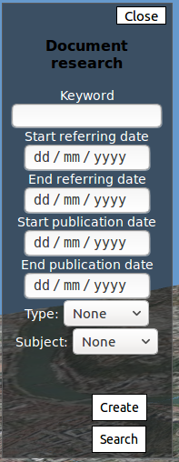
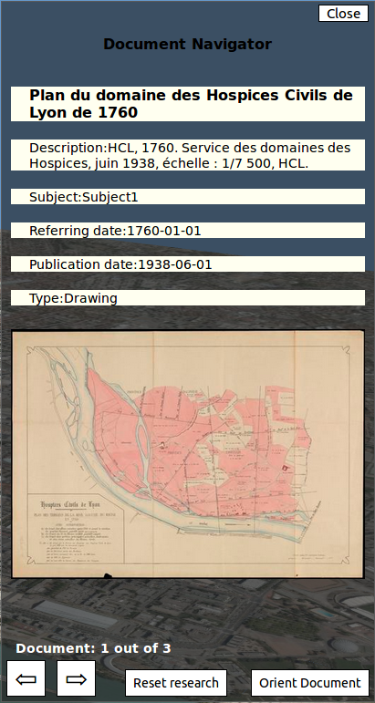
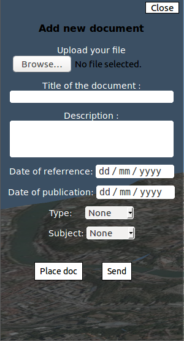

# Motivations

Providing UDV with a customizable/parameterizable Document model came in response to the general need of having to provide an application while several unknown variables of this application are yet unknown or fuzzy. For example:
 - the Document model is not fixed and even when some version is approved at some point, it is likely to evolve with upcoming needs
 - the final end users (e.g. a scientific community) as well as their associated requirements are not yet defined

Having at hand such a "generic/super" application, that can be customized to answer specific and evolving requirements coming from distinct user communities, allows to share/re-use a whole set of code.

On the UDV (frontend) side, the customization of an UDV front end is done through the edition of a configuration file that is to be realized by the [Deployment Responsible Person](https://github.com/MEPP-team/RICT/blob/master/Doc/Devel/Needs/Roles.md#deployment-responsible-person). It provides a lightweight and convenient configuration of an UDV frontend once the end user provides some version of what he/she needs. Such a configuration can thus be seen as a late statge of the development process.


# Configuring UDV
Some modules/extensions of UDV (e.g. [ConsultDoc](https://github.com/MEPP-team/UDV/tree/master/UDV-Core/src/Modules/ConsultDoc), [GuidedTour](https://github.com/MEPP-team/UDV/tree/master/UDV-Core/src/Modules/GuidedTour) or [Contribute](https://github.com/MEPP-team/UDV/tree/master/UDV-Core/src/Extensions/Contribute).
Depending on the UDV deployment that is realized, the Document Data Structure (DDS) can be customized in order to answer the specific needs of the realized deployment.
The following documentation explains how to realize such a Document Data Structure (DDS) customization, and in particular how to 
 - customize the UDV (frontend) with a given specific DDS
 - customize the following views of UDV that consume the DDS: 
    - Document browser view (of ConsultDoc module)
    - Document research view (of ConsultDoc module)
    - Document creation view (of Contribute extension)
    - Document update (view of Contribute extension)
    - GuidedTour view
 - define the external data server (backend) that the considered UDV deployment shall use
 - customize the [backend deployment](https://github.com/MEPP-team/UDV-server/tree/master/API_Extended_Document) to match the chosen DDS.

This DDS customization thus concerns the whole UDV system i.e. an UDV front end and the associated backend.


### Frontend configuration file general structure
The [configuration file](../src/Modules/ConsultDoc/examples/consultDocConfig.json) holds two main attributes : server and properties. 
* "server" holds the server-related information
* "properties" holds the document related information

````
{
    "type": "class",
    "server":{
            },
    "properties": {    
                  }
}
````

## I. Configure dependencies towards an external data server

We need to configure the field 'server' by giving the routes to the controller.


## II. Configuring the document model and the views: document browser, document creation, document update and document research

For this configuration, the field "properties" of the configuration file is used.
"Properties" holds the document attributes (e.g title, subject, referring date, date of publication...). 
It defines :
  - the document model = document's attributes
  - actions / functionalities on document attributes (e.g if this attribute is optional, if this attribute can be updated...)

There can be as many attributes as needed. They will be used to create* another json file holding the document model. The frame of this file looks as follows:

````
{
  "Document": {
    "type": "class",
    "properties": {
      }
   }
}
````
In order to respect the [static document model](https://github.com/JorisMillot/APIExtendedDocument/wiki/Documentation-API), properties have to be set in two different categories: metadata and visualization.

````
{
    "type": "class",
    "server":{
            },
    "properties": {
        "metadata":{
                   },
        "visualization":{
                        }  
                   }
}
````

An example of the file can be found [here](../src/Modules/ConsultDoc/examples/consultDocConfig.json)

Each document attribute has properties that impact the different views of the system (Browser, Creation, Update, Research...). They have to be parametrized.

###### How to parametrize the attributes' properties: 

| Property      | Type   | Authorized  values                       | Required                    | Concerned view | Description                                                                       |
|---------------|--------|------------------------------------------|-----------------------------|----------------|-----------------------------------------------------------------------------------|
| name          | string | document's attribute (title, refDate...) | yes                         | all            |                                                                                   |
| type          | string | string date enum                         | yes                         | all            |                                                                                   |
| optional      | bool   | true, false                              | yes                         | all            |                                                                                   |
| creationID    | string | create_[name]                            | yes if 'optional'=true      | Creation       |                                                                                   |
| labelCreation | string | everything                               | yes if 'optional'=true      | Creation       | gives information about the field to the user                                     |
| displayable   | bool   |  true, false                             | yes                         | Browser        |                                                                                   |
| displayID     | string | must be the same as 'name'               | yes if 'displayable' = true | Browser        |                                                                                   |
| label         | string | false or everything                      | yes                         | Browser        | If false, no label will be display. Otherwise, the chosen label will be displayed |
| updatable     | bool   | true false                               | yes                         | Update         |                                                                                   |
| updateID      | string | update_[name]                            | yes                         | Update         |                                                                                   |
| labelUpdate   | string | false or everything                      | no                          | Update         |                                                                                   |
| queryable     | bool   | false, true, keyword                     | yes                         | Research       |                                                                                   |
| queryID       | string | query_[name]                             | yes if 'queryable'=true     | Research       |                                                                                   |
| labelQuery    | string | false or everything                      | yes if 'queryable'=true     | Research       |                                                                                   |


Example:
````
{
    "type": "class",
    "server":{

        ... 
        server config
        ...

            },
    "properties": {
        "metadata":{
              "description":{
                  "name":"description",
                  "type": "string",
                  "optional": "false",
                  "creationID":"create_description",
                  "labelCreation":"Description: ",
                  "displayable":"true",
                  "displayID":"description",
                  "updatable":"true",
                  "label":"Description",
                  "updatable":"true",
                  "updateID":"update_description",
                  "labelUpdate":"Description: ",
                  "queryable":"keyword",
                  "queryID":"query_description',
                  "labelQuery":"false"
                            }
                  ...
                  other documents attributes and their properties
                  ...
                   },
        "visualization":{

                  ...
                  visualization attributes
                  ...

                        }  
                   }
}
````

What impacts the backend (database, mapping) are the attributes (fields of "properties" themselves (metadata (title, subject...), visualization...). See backend explanation later.

### Document research view

The research view is in form of a html formular. This formular is generated using js library alpaca. For this part, two files need to be created : schema.json and options.json. The files will be created depending on the configuration given in the [configuration file](../src/Modules/ConsultDoc/examples/consultDocConfig.json), that is to say by setting the attributes' properties related to the create view (see [table](Configuring-the-Document-model-of-an-UDV-deployment.md#how-to-parametrize-the-attributes-properties))

We can allow or disallow the research on an attribute by setting its "queryable" property.

We offer 3 research modes:
  - research by attribute (type, subject..)
  - research by keyword
  - temporal research (from a date, until a date, in a time period)

#### Research by attribute:

The research by attribute can only happen on attributes which are not dates. 

How to set the configuration:

 * attribute.queryable = "false": research on attribute is disabled
 * attribute.queryable = "true": standard attribute research
 
Example:

In the configuration file:  
* subject.queryable = "true" 
In the research form, the user will have the choice to enter a value in the field "subject" (example: urbanism). He will get all document whose subject matches the one he chose ( = all documents whose subject is urbanism).

#### Temporal research

How to set the configuration:
 * attribute.type = "date"
 * attribute.queryable = "true"

Example:
  * refDate.type = "date"
  * refDate.queryable = "true"
  * refDate.labelQuery = "referring date"
In the research view, two fields will be showed, called "Start referring date" (SRD) and "End referring date" (ERD).
The user can set both fields or only one one them.
 * SRD only is provided: get all documents whose referring date >= given SRD
 * ERB only is provided: get all documents whose referring date <= given ERD
 * SRD and ERD provided: get all documents whose referring date is between the given SRD end ERD

#### Keyword research

The keyword research can only happen on attributes which are not dates. 

How to set the configuration:
* attribute.queryable = "keyword"

Example:
In the configuration file:  
* description.queryable = "keyword"
* title.queryable = "keyword"

In the research form, a field "keyword" will be shown. The user writes "plan" in this field and launches the research. He will get all the documents where the word "plan" was found in the title or in the description.

General example:
We want to give the user the possibility to launch:
 - a temporal research on the date of publication and on the date of reference
 - a keyword research in title and description
 - a research by attribute on the type and on the subject

We set the properties in the [configuration file](../src/Modules/ConsultDoc/examples/consultDocConfig.json) as explained previously. 

The following figure shows the research view generated by this example:



### Document browser

The document browser only uses the properties.metadata.

How to set the configuration:
 * attribute.displaybable = true
 * attribute.label = "false" or attribute.label = "whatever you want to write"

Example: 
 * refDate.displayable = true
 * refDate.label = "Referring date: "
In the browser, we will have for example (among with other metadata whose displayable property is set to true) 

Referring date: 1945-01-01

All the attributes (of metadata) that have the "displayable" property set to "true" will be displayed in the Document Browser. If refDate.label = "false", we have only "1940-01-01"/


In this example, we want to display only the title of the document without writing that this is the title. So we set title.label = false.

On the other hand, to differentiate the two dates, we set their label property. refDate.label = "Referring date", publicationDate.label = "Publication date"

The order of the attributes in the document model also rules the order of display in the browser.

In this example, the following browser has been generated:



### Creation view

The creation view is in form of a html formular. This formular is generated using [JS library Alpaca](http://www.alpacajs.org/). 
To generate the creation form, two files are needed: schema.json and options.json. The files will be created depending on the configuration given in the [configuration file](../src/Modules/ConsultDoc/examples/consultDocConfig.json).

See associated [design note]

How to set the configuration:
 * attribute.optional = true OR false
 * attribute.creationID = create_[name]
 * attribute.labelCreation = something you want to say

Example:
 * title.optional = false
 * title.creationID = create_title
 * title.labelCreation = Title: 

In this example, we set the configuration so that 'title', 'description', 'refDate', 'publicationDate', 'subject' and 'type' must be provided to create a new Document. 

The following figure shows the creation view generated by this example:



We could add "rightsholder.optional = true" and in this way, the user would have the option to specify "rightsholder" or not. A field will be created in the creaton form but will not be mandatory.

### BACKEND: 

Note: this part is immature

A file "DocumentModel.json" is created based on the properties set in the configuration file.
The configuration file triggers (only one time) the generation of a "DocumentModel.json" file. 
This JSON respects the model defined in the [[document model|https://github.com/MEPP-team/UDV-server/blob/master/API_Extended_Document/README.md]].
This model is used to (re)create the entity class and (re)generate the DataBase, using this class directly, thanks to the ORM setting up.

No changes in the back-end will be needed when the document model evolves, but, if the model changes, the DataBase is recreated and data already existing in the DB is lost.

See [backend](https://github.com/MEPP-team/UDV-server/tree/master/API_Extended_Document)

### Things we need to be careful about (not exhaustive) 

- define the ID that need to be consistent (=the same) backend and frontend side
- this is great to have a super configurable application. What are the limit of the modularity? At one point, we may need to settle on some parameters.
- right very good documentation to explain how to write the file
- provide default configuration file

### Perspectives of evolution


 - use the file to configure "user mode" like: administrator, debug mode, contribute mode...
