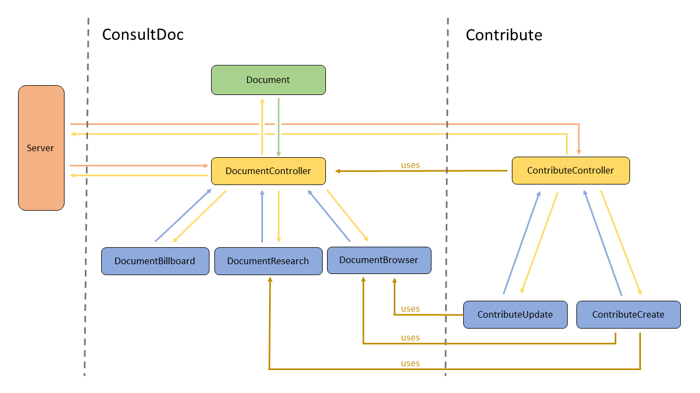

# Architecture

## Description

UDV-Core is split in several components, independent to each other, in order to create an application as modular as possible.
These components are : 
* **GuidedTour controller**
* **MiniMap controller**
* **Temporal controller**
* **Compass controller**
* **Extended document**
* **Contribute**

*A [[class diagram of udv-core|Pictures/UDVcoreClassDiagram.png]] can be found in the link below:*

Modules are based on a **MVC architecture**. MVC stands for **Model-View-Controller**:
* the **view** is in charge of displaying models and getting user's action;
* the **controller** is in charge of handling events from the view, communicate with the server to get information and data and create the correct models;
* the **model** represents a back-end object.

## ConsultDoc module

The **ConsultDoc module** handles different types of visualization of documents, such as **billboard mode**, **browser mode** or **attached mode**.
It also can allows the user to make a research using several filters, for instance a keyword research or publication research.

*  __Model__ : *Extended*Document
* __Controller__ : *DocumentController*
*  __Views__ : *DocumentBrowser*, *DocumentBillboard*, *DocumentResearch*, *DocumentPlacement*

*The scheme below shows structure and interaction inside **Contribute***:

## Contribute module

The **Contribute module** is composed of several functionalities such as the *creation*, *deletion* or *updating* of documents 
It uses **Document module** to display documents, which would be modify or delete and to handle the creation of a new document.

* __Controller__ : *ContributeController*
* __Views__ : *ContributeCreate, ContributeUpdate*

*The scheme below shows structure and interaction between **Contribute** and how it uses **Document module***:

