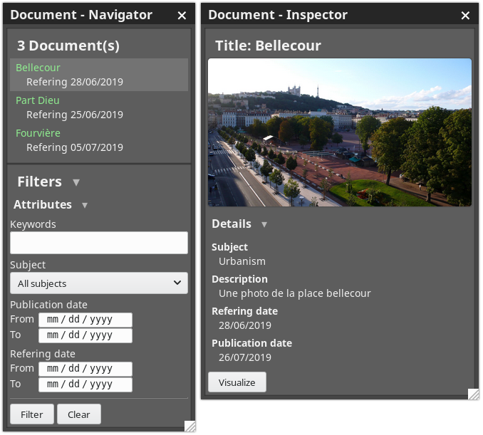
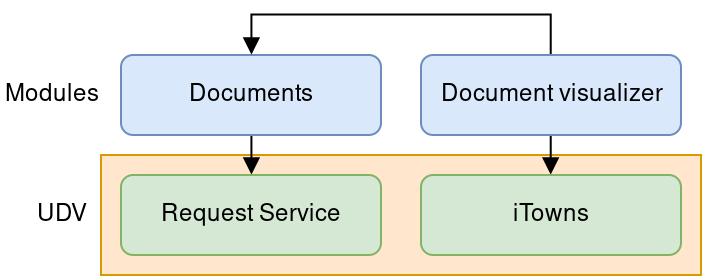

# Documents Module

The documents module is responsible for managing and display documents. Its purpose is to retrieve documents from a server, filter them to have a restrain list, display this list and allow the use to navigate inside (by seeing the details of each document).

The module is also extensible, which means that other modules can serve as plug-ins extending the functionnalities of the documents module. They can to that in many ways :

- Change the source of documents
- Apply new filters
- Add a window to display
- Modify the navigator and/or the inspector windows to add elements such as text, buttons, etc.

## Basic functionnalities

In the [demo](./Example/Demo.html), you can try out the basic functionnalities of the document modules. It can:

- Fetch all documents from the server. It's actually the default comportement (and may change in the future for scaling purpose). The user can filter the retrieved list according to some filters: keywords in the title/description, subject, publication or refering date.
- Display the details of one particular documents, and navigate through the documents list. The navigation can be done either by selecting a document in the document list, or by using navigation arrows in the document inspector.



The demo also includes the `DocumentVisualizer` module, that adds an "Orient" button in the document inspector. When pressed, the button moves the camera to the "visualization" position specified in the document, and the image of the document is displayed in superposition to the scene.

## Usage

Adding the documents module in a demo is pretty simple :

```js
////// DOCUMENTS MODULE
const documentModule = new udvcore.DocumentModule(requestService, baseDemo.config)
baseDemo.addModuleView('documents', documentModule.view);

////// DOCUMENTS VISUALIZER (to orient the document)
const imageOrienter = new udvcore.DocumentImageOrienter(documentModule, baseDemo.view, baseDemo.controls);
```

In this example, we actually add the document visualizer in addition to the documents module.

### Required configuration

The minimal configuration required to make the documents module work is the following :

```json
{
  "type": "class",
  "server":{
    "url":"http://localhost:1525/",
    "document": "document",
    "file": "file"
  }
}
```

`server.url` represents the base URL for the server. The documents service expects it to be a REST API, where access routes are in the form `{baseURL}/{document}` for documents (e.g. "http://localhost:1525/document") and `{baseURL}/{document}/{id}/{file}` for files associated with documents (e.g. "http://localhost:1525/document/1/file" for the file associated with the document of ID 1).

### Dependencies

The documents module depends on the utility `RequestService` to perform HTTP requests, and require the demo configuration to get the server addresses.

The document visualizer depends on the documents module, and the iTowns view and camera controls from the demo.



## Code architecture

The code architectures follows an [MVVM](https://en.wikipedia.org/wiki/Model%E2%80%93view%E2%80%93viewmodel) architectural pattern.

- The model is responsible for holding the documents. It fetches them from the server and store them in a list. The objects responsible for making the requests are the `DocumentService` and the `DocumentSource`.
- The view model serves as an interface between the view and the model. It holds a `DocumentProvider` that retrieve the document list fetched by the model, and dispatch it into two types of documents. First, the filtered documents is a smaller list of documents reduced according to some filters (which are istances of `DocumentFilter`). Second, it holds a reference to the "displayed document" which is one particular document in the filtered documents list.
- The view is responsible to display the data in the view model and react to user input. It has two windows : a navigator window that holds a form corresponding to search filters and displays the filtered documents list. It also has a inspector window that shows the displayed document. In the code, the view is separated into three classes : the `DocumentView` holds a reference to the two windows, `DocumentNavigatorWindow` and `DocumentInspector`.

## Extensions

In this part, we are explaining how other modules can extend the functionnalities of the document module by serving as "plug-ins".

A module that wishes to extend the documents module should take a `DocumentModule` object in its constructor. This object is the root of the module and provide a direct access to the instances of the view, view model and the model. However, an extending module should only uses methods from the `DocumentModule` in order to correctly work. The only exception is the windows that extends `AbstractDocumentWindow`, which are given access to the view model and the view.

### Adding visual elements

Adding visual interface elements to the view can be done in two ways :

- Extending one of the navigator or inspector window.
- Adding a new window.

#### Extending the navigator or inspector window

Extending one the existing windows can be done pretty easily from the `DocumentModule`:

```js
documentModule.addInspectorExtension('MyExtension', {
  type: 'button',
  container: 'left',
  html: 'Click here to show the title !',
  callback: (doc) => {
    alert('The title of the current document is : ' + doc.title);
  }
});
```

In this example, we add a button (`type: 'button'`) in the inspector window. Its text shall be 'Click here to show the title !' and when clicked, it displays the title of the displayed document.

We also pass a `container` parameter that specifies where in the window the button should be added. In this example, it will be added in the "left" side of the buttons section. To see available containers, please refer to the `addInspectorExtension` documentation.

As you can see, adding an extension is done by providing a descriptive object that specifies a type, the HTML content and eventually a callback. For the moment, only two types are supported : 'button' which is a button that triggers a callback, and 'panel' which is simply a chunk of static HTML.

```js
documentModule.addInspectorExtension('MyExtension', {
  type: 'panel',
  html: `
    <h3>My Extension</h3>
    <p>
      The title of the document is : <span id="title"></span>
    </p>
  `
});
documentModule.addEventListener(DocumentModule.EVENT_DISPLAYED_DOC_CHANGED, (doc) => {
  document.getElementById('title').innerText = doc.title;
});
```

In this example, we create a new section in the inspector window that keeps track of the document title. We do this by passing a string of HTML, in which a `span` tag has a specific 'title' ID that we can use later. We then adds an event listener so that when the currently displayed document change, our custom section will update and render the title.

You notice that no `container` value has been passed in parameter. That's because our inspector window currently has only one container available for panels, so the parameter is optional.

The `addInspectorExtension` also has an equivalent for the navigator window, which is called `addNavigatorExtension`. It has the same behaviour, except one difference for the buttons elements : the callback does not pass the displayed document as parameter, but the list of filtered documents.

#### Adding a new window

The addition of a new window for documents is made through the `AbstractDocumentWindow` class (in the `View` folder) that represents a window responsible for displaying document data, and interacting with the document provider. The base code inside the extending window should look like like this :

```js
export class ExtensionWindow extends AbstractDocumentWindow {
  constructor() {
    super('Extension Name');
  }

  get innerContentHtml() {
    return /*html*/`

    `;
  }

  windowCreated() {
    this.hide();
  }

  documentWindowReady() {
    
  }
}
```

This window is empty and does nothing. In fact, it doesn't event displays as we specified `this.hide()` when the window is created. This will allow us to display the window when the user clicks on a button in the document inspector for example, but we'll see that in a few paragraphs. For the moment, let's just register our new window :

```js
// MyModule.js
let myWindow = new ExtensionWindow();
documentModule.addDocumentWindow(myWindow);
```

This code tells the view to register the new document window in its windows list. We can also do this in the `ExtensionWindow` by taking the documents module as parameter of the constructor :

```js
// ExtensionWindow.js
constructor(documentModule) {
  documentModule.addDocumentWindow(this);
}

// MyModule.js
let myWindow = new ExtensionWindow(documentModule);
```

Now that we've done that, what actually changed is that our window has access to the view and the view model of the documents module. It has two members, `view` and `provider` refering to the `DocumentView` and the `DocumentProvider`. They are not warranted to be instantiated right at the beginning, but we provide a hook function that triggers when these two elements are set :

```js
documentWindowReady() {
  // `provider` and `view` are now usable
  this.provider.addEventListener(DocumentProvider.EVENT_FILTERED_DOCS_UPDATED,
    (docs) => {});
  this.provider.addEventListener(DocumentProvider.EVENT_DISPLAYED_DOC_CHANGED,
    (doc) => {});
}
```

Now we need to add a button to actually display our window. Let's say we want to add this button in the document inspector. All we need to do is the following :

```js
documentModule.addInspectorExtension('MyExtension', {
  type: 'button',
  html: 'Show my window',
  callback: () => myWindow.requestDisplay()
});
```

The `requestDisplay` methods tells the view to display the specified window.

### Interacting with the model

An external module has two ways of interacting with the model : changing the source of documents, and adding custom filters.

#### Changing the source

Changing the document source means changing the server configuration. This is done by instantiating a `DocumentSource` object with the correct parameters. One way of doing that is to create a custom objects that inherits this class :

```js
export class MyCustomSource extends DocumentSource {
  constructor(config) {
    super();

    this.myCustomUrl = `${config.customUrl}${config.customDocs}`;
    this.fileRoute = config.customFiles;
  }

  getDocumentUrl() {
    return this.myCustomUrl;
  }

  getImageUrl(doc) {
    return this.myCustomUrl + '/' + doc.id + '/' + this.imageRoute;
  }
}
```

Here, we suppose that the UDV configuration has an object like this :

```json
{
  "customUrl": "http://custom-url.com/",
  "customDocs": "my-documents",
  "customFiles": "my-file"
}
```

So, by using the source we provided, the document service will now retrieve the documents using the URL returned by `getDocumentUrl` (in this case, it will be `http://custom-url.com/my-documents`) and document files using `getImageUrl` (in our example, `http://custom-url.com/my-documents/{id}/my-file`).

To change the document source, we can use the `changeDocumentSource` method of the documents module :

```js
let mySource = new MyCustomSource(config);
documentModule.changeDocumentSource(mySource, true);
```

The second parameter indicates that authentication should be used with this source.

#### Adding filters

The other way of changing the document list is by adding new filters. This is done by providing an instance of the `DocumentFilter` class. A filter in its simplest form is basically a function that takes a document in input, and returns a boolean indicating wether the filters "accepts" the document. If yes, the document will be kept in the filtered document list, otherwise it will not appear in the list.

Let's construct a filter that only keeps documents that have a title with less than 3 words :

```js
let titleFilter = new DocumentFilter((doc) => {
  let wordCount = doc.title.split(' ').length;
  return wordCount < 3;
});

documentModule.addFilter(titleFilter);
```

Creating our filter is really simple : we only need to instantiate a `DocumentFilter` object and pass the acceptation function to it. In this example, we use an arrow function that captures the context in which it was created. This allows us to make dynamic filters, like this one :

```js
this.maxWordCount = 3;

let titleFilter = new DocumentFilter((doc) => {
  let wordCount = doc.title.split(' ').length;
  return wordCount < this.maxWordCount;
});

documentModule.addFilter(titleFilter);

// Later, we can change our filter
this.maxWordCount = 5;
documentModule.refreshDocumentList();
```

In this example, we only keep documents that have a title with less than N words, where N is determined by the `maxWordCount` variable. This means that our filter is dynamic and can be updated anytime during the execution. This also means that we can deactivate our filter, by specifying :

```js
this.maxWordCount = Infinity;
```

As there will always be a finite number of words in a document title, the filter will let all documents pass.